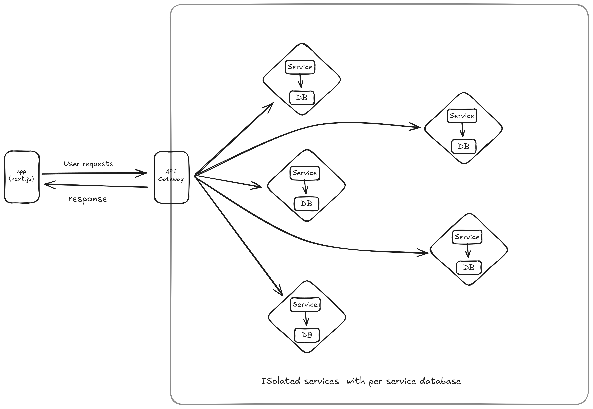

# Architecture Overview

> Architecture will change as the project evolves and everything will be recorded in the ADRs and RFCs.

This project is structured into several key components to ensure modularity and maintainability. Below is an overview of the architecture:

- Backend (GoLang)
    - API Gateway: One Entry point for all requests.
    - Microservices: Each service handles a specific business function.
    - Database: Database per service design for data isolation.
    - Authentication Service: Manages user authentication and authorization.
    - Logging and Monitoring: Centralized logging and monitoring for all services.
- Frontend (Next.js)
    - User Interface: Responsive design for various devices.
    - State Management: Using Redux or Context API for managing application state.
    - API Integration: Communicates with backend services via RESTful APIs.
- Services:
  - API Gateway: Handles incoming requests and routes them to the appropriate microservice.
  - Authentication Service: Manages user authentication and authorization.
  - User Service: Manages user profiles and related data.
  - Chat Service: Handles real-time messaging and chat functionalities.
  - Notification Service: Manages notifications and alerts for users.
  - Media Service: Handles media uploads, storage, and retrieval.
  - Search Service: Provides search capabilities across the platform.
  - Community Service: Manages community features such as groups and forums.
  - Voice Service: Handles voice communication features.
  - Video Service: Manages video communication and streaming features.
  - Payment Service: Manages payment processing and subscriptions.
  - Analytics Service: Collects and analyzes user data for insights and reporting.
  - Admin Service: Provides administrative functionalities and controls.
  - Role-Based Access Control (RBAC) Service: Manages user roles and permissions.
  - Content Moderation Service: Handles content filtering and moderation.
- Deployment & Infrastructure
  - Containerization: Using Docker for containerizing services.
  - Orchestration: Kubernetes for managing containerized applications.
  - CI/CD Pipeline: Automated build, test, and deployment processes.
  - Cloud Provider: Hosting on Digital Ocean.
  - Messaging Queue: RabbitMQ/NATS for asynchronous communication between services.
  - Monitoring: Prometheus, OpenTelemetry and Grafana for monitoring and alerting.
  - Logging: ELK Stack (Elasticsearch, Logstash, Kibana) for centralized logging.
  - CDN: Cloudflare for content delivery and caching.


## Diagram

V1.0

[](../diagrams/architecture/creavio-app-architecture-v1.svg)


```plaintext
+---------------------+        +---------------------+        +---------------------+
|   Frontend (Next.js)| <----> |     API Gateway     | <----> |  Authentication     |
+---------------------+        +---------------------+        +---------------------+
                                      |   ^   ^   ^   ^
                                      v   |   |   |   |
                            +---------------------+        +---------------------+
                            |     User Service    |        |     Chat Service    |
                            +---------------------+        +---------------------+

                                        |   ^   ^   ^   ^
                                        v   |   |   |   |
                                +---------------------+        +---------------------+
                                |  Notification Service|        |     Media Service   |
                                +---------------------+        +---------------------+
                                        |   ^   ^   ^   ^
                                        v   |   |   |   |
                                +---------------------+        +---------------------+
                                |     Search Service  |        |  Community Service  |
                                +---------------------+        +---------------------+
                                        |   ^   ^   ^   ^
                                        v   |   |   |   |
                                +---------------------+        +---------------------+
                                |     Voice Service   |        |     Video Service    |
                                +---------------------+        +---------------------+
                                        |   ^   ^   ^   ^
                                        v   |   |   |   |
                                +---------------------+        +---------------------+
                                |    Payment Service  |        |    Analytics Service |
                                +---------------------+        +---------------------+
                                        |   ^   ^   ^   ^
                                        v   |   |   |   |
                                +---------------------+        +---------------------+
                                |      Admin Service  |        |       RBAC Service  |
                                +---------------------+        +---------------------+
                                        |   ^   ^   ^   ^
                                        v   |   |   |   |
                                +---------------------+
                                | Content Moderation  |
                                +---------------------+
    
```

## Relevant ADRs and RFCs
- [ADRs](./ADR/README.md)
- [RFC](./RFC/README.md)